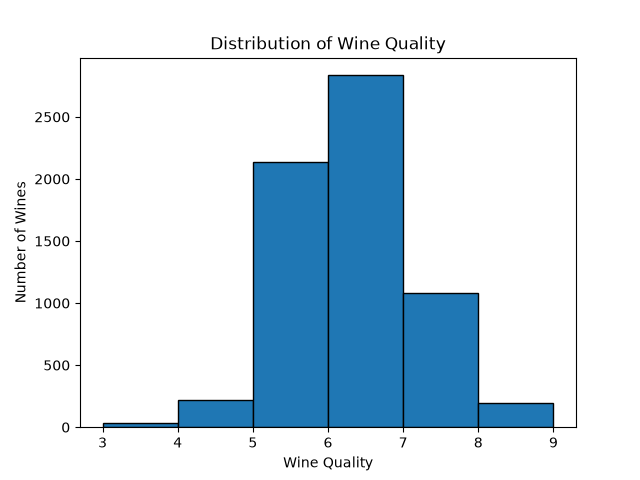
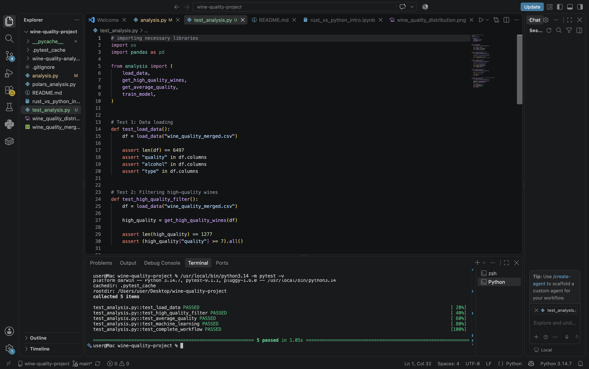

# Wine Quality Data Analysis

## Project Overview

This project analyzes the Wine Quality dataset using Python. The dataset contains information about red and white wines and includes chemical properties such as acidity, pH, sulphates, alcohol content, and wine quality ratings.

The project uses Pandas for data analysis, Matplotlib for visualization, and Scikit-learn for a simple machine learning model. Polars is also used to perform similar data analysis operations and compare its performance with Pandas.

A Rust Jupyter notebook is also included to experiment with Rust concepts such as ownership and borrowing.

## Dataset

The dataset used in this project is `wine_quality_merged.csv`.

The dataset contains:

- 6,497 rows
- 13 columns
- Red and white wines
- Wine quality scores ranging from 3 to 9

Some of the variables include:

- Fixed acidity
- Volatile acidity
- Citric acid
- Residual sugar
- Chlorides
- pH
- Sulphates
- Alcohol
- Quality
- Wine type

## Pandas Analysis

The Pandas analysis is contained in:

`analysis.py`

The script performs several basic data analysis operations:

- Loads the wine quality dataset
- Displays the first five rows
- Examines dataset information and data types
- Generates summary statistics
- Checks for missing values
- Checks for duplicate rows
- Filters wines with a quality score of 7 or higher
- Calculates average wine quality by wine type
- Creates a visualization of wine quality
- Builds a simple linear regression model

### Analysis Results

There are 6,497 wines in the dataset.

There are no missing values in the dataset.

Using Pandas, 1,177 duplicate rows were identified.

There are 1,277 wines with a quality score of 7 or higher.

The average quality scores were:

- Red wine: approximately 5.636
- White wine: approximately 5.878

White wine therefore had a slightly higher average quality score in this dataset.

## Data Visualization

The project creates a histogram showing the distribution of wine quality scores.

The majority of wines have quality ratings around 5 and 6, while very low and very high quality scores occur less frequently.

## Machine Learning

A simple linear regression model was created using Scikit-learn.

The model uses:

- Input variable: Alcohol
- Output variable: Wine Quality

The dataset was divided into training and testing sets using an 80/20 split.

The Mean Squared Error (MSE) of the model was:

`0.6044`

This model provides a simple example of using a wine characteristic to predict wine quality.

## Pandas vs Polars

The same filtering and grouping analysis was performed using Polars in:

`polars_analysis.py`

Execution time was measured using Python's `time.perf_counter()`.

| Operation | Pandas | Polars |
|---|---:|---:|
| CSV Load | 0.00412 seconds | 0.01047 seconds |
| Filtering + Grouping | 0.00104 seconds | 0.01478 seconds |

In this run, Pandas was faster than Polars for both loading the CSV file and performing the filtering and grouping operations.

The dataset contains only 6,497 rows, so this is a relatively small workload. Performance results can vary between runs, and Polars may perform differently when working with larger datasets.

Both Pandas and Polars produced the same main analysis results:

- 1,277 wines had a quality score of 7 or higher.
- Average red wine quality was approximately 5.636.
- Average white wine quality was approximately 5.878.

## Rust Ownership Experiment

The project also includes the modified Rust Jupyter notebook:

`rust_vs_python_intro.ipynb`

The notebook was run using the Rust Jupyter kernel and modified to further experiment with Rust ownership and borrowing.

One experiment demonstrates ownership transfer. When a `String` is assigned to another variable, ownership moves to the new variable. The original variable can no longer be used after the move.

Another experiment explores borrowing using references. Instead of transferring ownership, a reference can borrow a value, allowing the original owner to continue using the value.

These experiments helped demonstrate the difference between moving a value and borrowing a value in Rust.

## Project Files

The repository contains:

- `analysis.py` - Pandas data analysis and linear regression
- `polars_analysis.py` - Polars analysis and performance comparison
- `wine_quality_merged.csv` - Wine Quality dataset
- `wine_quality_distribution.png` - Wine quality visualization
- `rust_vs_python_intro.ipynb` - Modified Rust Jupyter notebook
- `README.md` - Project documentation
- `test_analysis.py` - Automated tests for the analysis workflow
- `requirements.txt` - Python dependencies
- `.github/workflows/tests.yml` - GitHub Actions CI workflow
- `tests_passed.png` - Screenshot showing successful test results

## Tools and Libraries

The project uses:

- Python
- Pandas
- Polars
- Matplotlib
- Scikit-learn
- Rust
- Jupyter Notebook

## Testing

The project includes automated tests using `pytest` to validate the main components of the data analysis workflow.

The tests cover:

- Loading the wine quality dataset
- Filtering high-quality wines
- Calculating average quality by wine type
- Training and evaluating the linear regression model
- Running the main components together as a complete workflow

All five tests pass successfully.

## Continuous Integration

GitHub Actions is configured to automatically run the test suite whenever changes are pushed to the `main` branch or submitted through a pull request.

The workflow installs the required Python dependencies and runs the tests using `pytest`. The CI status badge at the top of this README shows the current status of the automated test workflow.

## Conclusion

This project explored the Wine Quality dataset using Pandas and Polars. The analysis showed that white wine had a slightly higher average quality score than red wine and that 1,277 wines had a quality rating of 7 or higher.

A simple linear regression model was also used to predict wine quality based on alcohol content. In addition, Pandas and Polars were compared using execution time. For this relatively small dataset, Pandas was faster in the measured operations.

Finally, the Rust Jupyter notebook was modified to experiment with ownership and borrowing, providing practical examples of how Rust manages values and memory. 