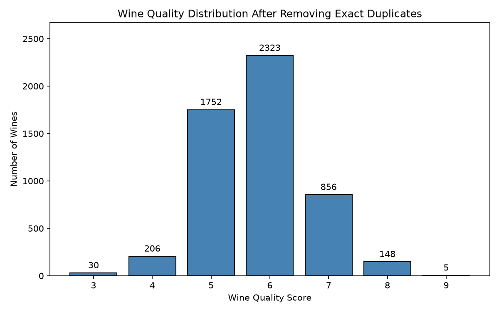
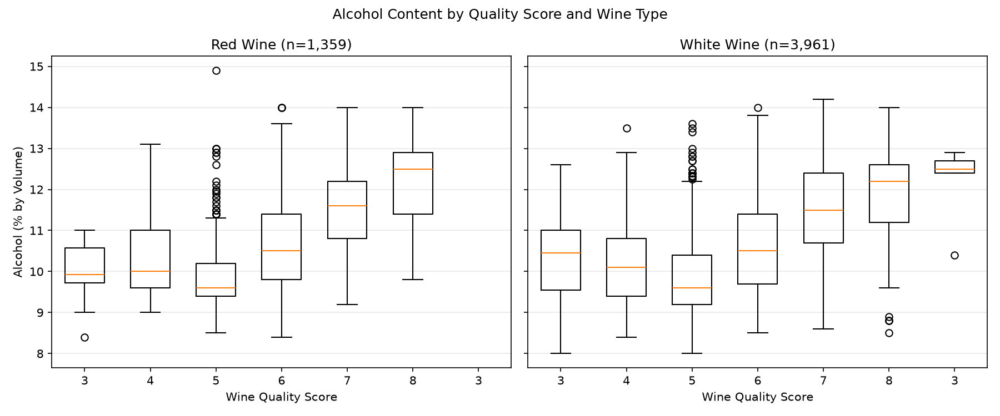
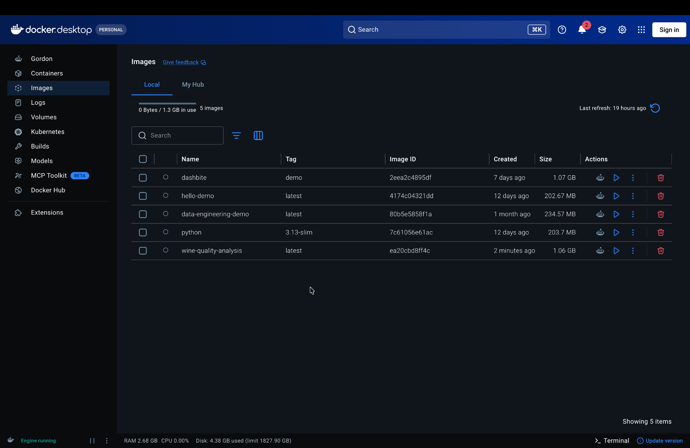
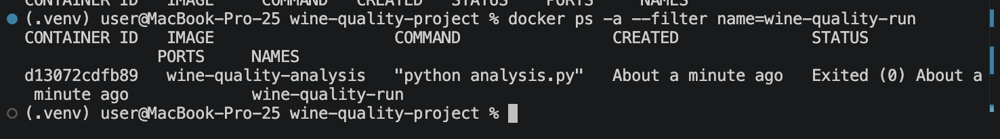
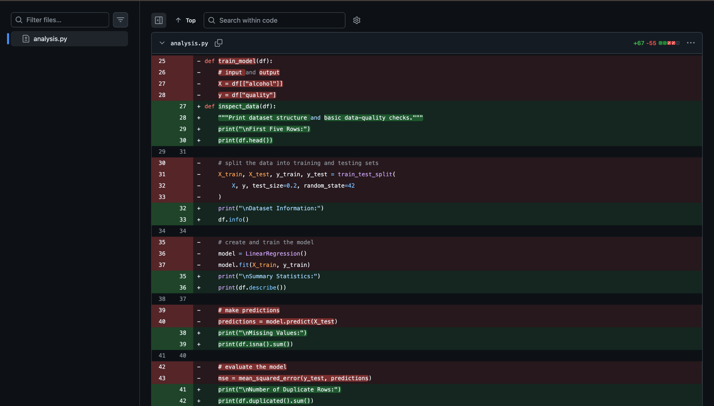

# Wine Quality Analysis

[](https://github.com/qurbanovkenan77-tech/wine-quality-analysis/actions/workflows/tests.yml)

## Project Question

How useful is alcohol content for predicting wine quality, and is its relationship with quality similar for red and white wines?

Wine quality ratings reflect more than a single chemical measurement. This project explores whether alcohol content provides useful predictive information while recognizing that it cannot fully explain wine quality or replace sensory evaluation.

The project includes data preparation, visualizations, an alcohol-only regression model, a baseline comparison, automated tests, GitHub Actions, and Docker.

## Dataset

Source: [Red and White Wine Quality on Kaggle](https://www.kaggle.com/datasets/amirmohamadrezaie/red-and-white-wine-quality)

The original file, `wine_quality_merged.csv`, contains:

- 6,497 rows and 13 columns.
- 1,599 red wines and 4,898 white wines.
- 11 chemical measurements, a quality score, and wine type.
- Observed quality scores from 3 to 9.
- No missing values.

The original CSV is preserved unchanged.

## Data Preparation

The main Pandas analysis removes 1,177 exact duplicate rows, leaving 5,320 unique records: 1,359 red wines and 3,961 white wines.

Duplicates are removed before the train/test split to prevent identical complete records from appearing in both sets. Without sample identifiers, it is not possible to determine whether identical records represent repeated entries or separate samples with identical measurements. Removing them is a documented analysis choice.

Validation checks required columns, empty datasets, missing values, numeric alcohol and quality fields, allowed wine types, and valid alcohol and quality ranges. Invalid input raises an error rather than being silently processed.

Potential outliers are flagged using the 1.5 × IQR rule separately for each wine type and chemical feature. They are retained because an unusual value is not necessarily a measurement error. Quality scores are excluded from this outlier check. Counts are per feature, so one wine can be flagged more than once.

## Key Findings

Results below use the cleaned dataset.

| Wine type | Records | Mean quality | Alcohol–quality correlation |
|---|---:|---:|---:|
| Red | 1,359 | 5.6233 | 0.4803 |
| White | 3,961 | 5.8548 | 0.4629 |

- 1,009 wines have a quality score of at least 7, the threshold used here to describe high-quality wines.
- White wines have a slightly higher average rating in this dataset.
- Alcohol and quality have a moderate positive association for both wine types.
- The two correlations are similar. No statistical test of their difference was performed.

These are associations, not evidence that increasing alcohol causes better wine quality.

## Visualizations

Most wines receive middle-range quality scores.



The boxplots compare alcohol distributions across quality scores for red and white wines. Rare quality scores have fewer observations and should be interpreted cautiously.



## Model Evaluation

An alcohol-only linear regression is compared with a baseline that predicts the training-set mean quality for every test observation.

Both models use the same 80/20 split of the cleaned data, with `random_state=42`: 4,256 training rows and 1,064 test rows.

| Model | MSE | RMSE | MAE | R² |
|---|---:|---:|---:|---:|
| Training-mean baseline | 0.7527 | 0.8676 | 0.6942 | -0.0011 |
| Alcohol regression | 0.5861 | 0.7656 | 0.6009 | 0.2204 |

The regression reduces test MSE by **22.13%** relative to the baseline. Its average absolute error is approximately **0.60 quality-score points**.

Alcohol provides useful predictive information, but substantial variation remains unexplained. Results come from one fixed split, not cross-validation. The model treats an ordinal quality score as continuous, uses only one predictor, and is intended as an educational analysis rather than a production rating system.

Saved results:

- `model_comparison.csv`
- `alcohol_quality_by_type.csv`

## Project Files

| File | Purpose |
|---|---|
| `analysis.py` | Data cleaning, analysis, charts, and model evaluation |
| `polars_analysis.py` | Supplementary analysis of the original data |
| `test_analysis.py` | Automated tests, including edge cases |
| `wine_quality_merged.csv` | Original dataset |
| `wine_quality_distribution.png` | Cleaned quality-score distribution |
| `alcohol_by_quality.png` | Alcohol distributions by quality and wine type |
| `model_comparison.csv` | Regression and baseline evaluation metrics |
| `alcohol_quality_by_type.csv` | Summary statistics and correlations |
| `rust_vs_python_intro.ipynb` | Earlier Rust ownership and borrowing exercises |
| `requirements.txt` | Pinned Python dependencies |
| `.flake8` | Linting configuration |
| `.github/workflows/tests.yml` | Automated CI checks |
| `Dockerfile` | Container build instructions |
| `.dockerignore` | Files excluded from the Docker build context |
| `docs/screenshots/` | Docker and refactoring evidence |
| `README.md` | Project findings and instructions |

## Run Locally

Use Python 3.13. Run commands from the repository's main directory.

```bash
git clone https://github.com/qurbanovkenan77-tech/wine-quality-analysis.git
cd wine-quality-analysis
python3 -m venv .venv
source .venv/bin/activate
python -m pip install -r requirements.txt
python analysis.py
```

The analysis prints findings and regenerates both PNG charts and both result CSVs in the current directory.

To run the supplementary Polars analysis:

```bash
python polars_analysis.py
```

Dependency versions are recorded in `requirements.txt`. Execution timings vary with hardware and system load.

## Tests and Code Quality

```bash
python -m pytest -v
python -m black --check analysis.py polars_analysis.py test_analysis.py
python -m flake8 --config=.flake8 analysis.py polars_analysis.py test_analysis.py
```

The 30 tests cover data loading, known summary results, duplicate removal, preservation of input data, empty inputs, missing columns and values, invalid numeric values, unknown wine types, filtering boundaries, outlier handling, a known linear relationship, and the baseline calculation.

GitHub Actions installs dependencies, checks formatting and linting, runs the tests, and executes both analysis scripts on pushes and pull requests to `main`. It can also be triggered manually. The workflow uses an operating-system matrix to check Python 3.13 on Ubuntu and macOS. It also includes a weekly scheduled run on Mondays at 09:17 UTC.
## Docker

Docker packages the scripts, dataset, Python environment, and dependencies.

Build and run:

```bash
docker build -t wine-quality-analysis .
docker run --rm wine-quality-analysis
```

Run tests inside the container:

```bash
docker run --rm wine-quality-analysis python -m pytest -v
```

The analysis finishes automatically. An exit code of 0 indicates successful completion. All 30 tests also passed inside Docker.

The default run writes outputs inside the container. With `--rm`, those outputs are removed when the container exits. To retain and copy outputs, use a named container:

```bash
docker run --name wine-quality-export wine-quality-analysis
docker cp wine-quality-export:/app/model_comparison.csv ./model_comparison.csv
```

Use an unused container name when repeating that example.

During Docker practice, the commands `docker pull`, `docker images`, `docker run`, `docker ps`, and `docker ps -a` were used. An image is the packaged environment; a container is an instance of that image.

Built image:



Successful container completion:



## Refactoring

The original script was reorganized into focused functions for inspection, plotting, data preparation, and model evaluation. The main workflow now lives in `main()`, and unclear model variables were renamed.

This makes individual steps easier to understand, reuse, and test. The initial refactoring preserved the original calculations: the five existing tests passed and the original MSE remained 0.6044. Later changes introduced cleaning, additional analysis, and the expanded 30-test suite.

[View the initial refactoring commit](https://github.com/qurbanovkenan77-tech/wine-quality-analysis/commit/cf81f29)



## Earlier Project Components

`polars_analysis.py` preserves the earlier analysis of the original, uncleaned dataset. It reports 1,277 high-quality wines, whereas the cleaned Pandas analysis reports 1,009. These counts use different data preparation and should not be treated as contradictory.

The scripts print execution timings, but the current runs are not a controlled performance benchmark between Pandas and Polars.

`rust_vs_python_intro.ipynb` contains earlier exercises on Rust ownership and borrowing. It is supplementary and is not executed by the Python CI workflow or Docker image. Running it requires a separate Rust Jupyter kernel.

## AI Assistance

ChatGPT assisted with refactoring suggestions, test design, Docker and CI configuration, and documentation. Changes were checked through local execution, automated tests, GitHub Actions, and a Docker run.